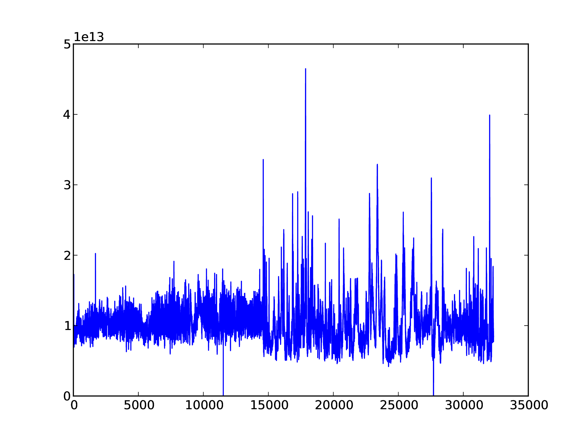
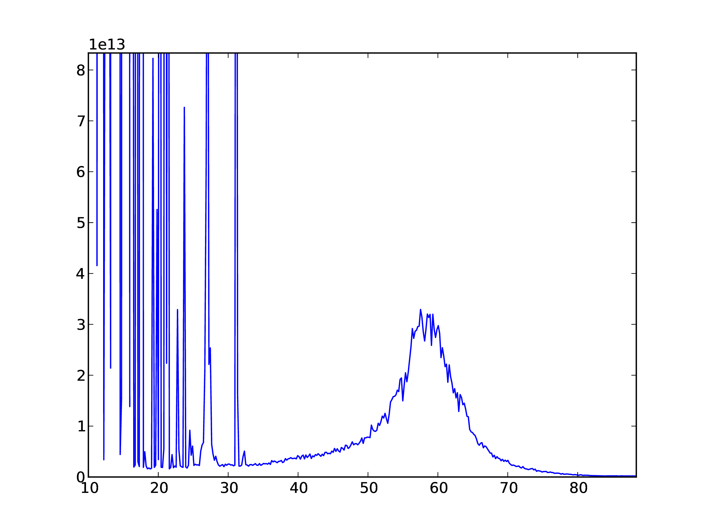
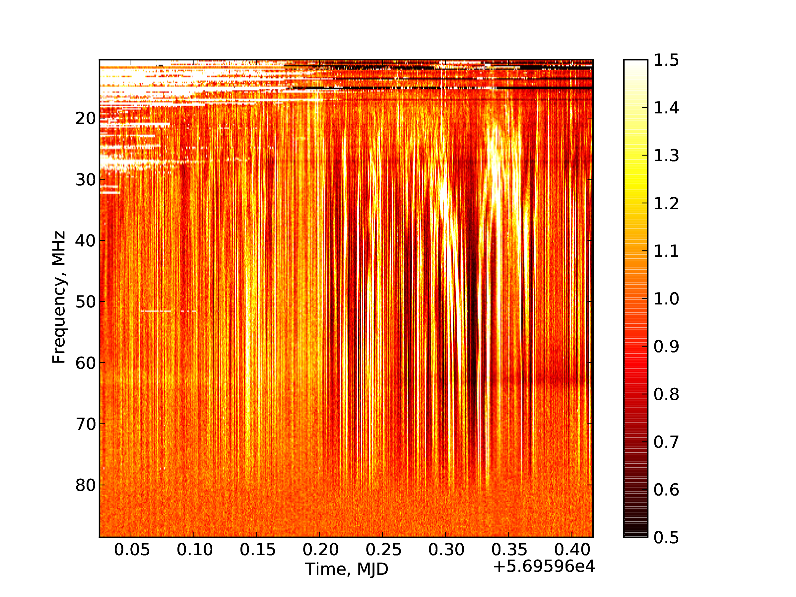
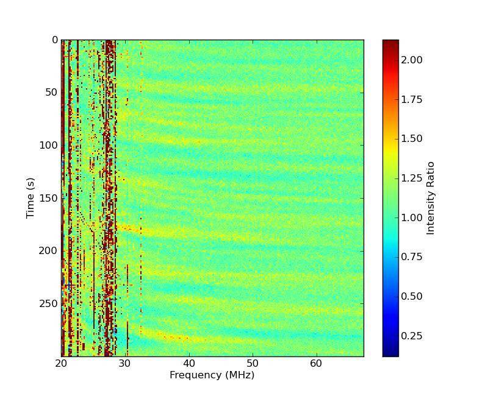
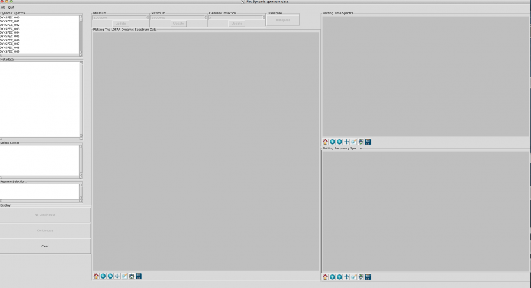
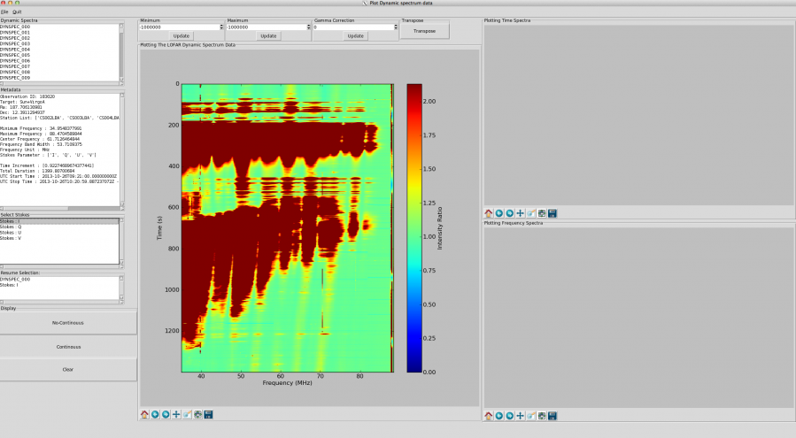
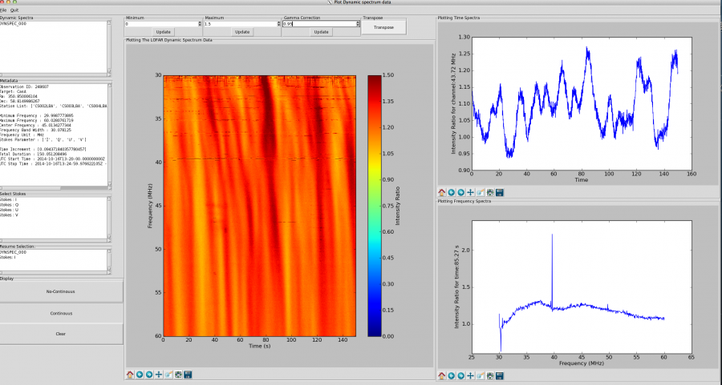

Introduction
============

Beam-formed data, where delays are applied to the incoming data to 'point' a radio telescope array in a specified direction have many uses. The resulting data are time-frequency ("dynamic spectrum") data of the target radio source recorded at much higher resolution than is possible using the interferometer alone.  Such data are used to study, for example, radio signatures of solar bursts, planetary emission from Jupiter and scintillation of a compact source due to the ionosphere or solar wind. This cookbook will focus in particular on the Solar applications detailed in chapter :ref:`solar applications <solarapplication>` and on the pulsar case detailed in chapter :ref:`Pulsar Pipeline (PulP) <pulp>`.

In this chapter the structure of the beam-formed data format is detailed alongside examples of how these data may be read using a dedicated Dynamic Spectrum toolkit or a regular python script. The basic data product returned by the individual LOFAR stations, it also enables valuable science to be done using single stations.

----------------
Beam definitions
----------------

Before detailing the structure and use of beam-formed data recorded by LOFAR, it is first useful to give a brief reminder of the definitions of the various beams which can be formed.

+ High-band array (HBA) "tile beam":
   + Each HBA tile contains an analogue beam-former which is used to 'point' the tile in a given direction.
   + Half-power beam width is approximately 15 to 30 degrees over the frequency range 240 to 110 MHz.
   + Only on beam can be formed at a time.
+ Station beam or "sub-array pointing":
   + A digital beam-former at each station is used to combine low-band antennas or HBA tiles within a station to 'point' in a given direction.
   + Capable of forming up to 488 'beamlets' (in 8-bit mode). Each beamlet represents a single pointing direction with a bandwidth of one sub-band (195.3125 kHz when the 200 MHz sampling clock is used).
   + A station beam is formed from the combination of any number of these beamlets.
   + Multiple station beams can be formed so long as the total number of beamlets does not exceed the maximum. Thus the bandwidth available to each beam is reduced according to the number of station beams formed.
+ Beams formed by the main correlator (COBALT):
   + "Tied-array beams (TAB)":
      + Each station beam returned from multiple stations can be combined coherently to form multiple tied-array beams, each with a different pointing.
      + Represent the narrowest beams which can be formed with LOFAR, with half-power beamwidths of less than 0.1 degree depending on frequency and the baselines of stations used.
      + bla
      + Up to approximately 200 beams can be formed each with the same bandwidth as the station beam(s) used.
      + Restricted to core stations only.
   + "Incoherent beam":
      + Each station beam returned from multiple stations can be combined incoherently to form a single incoherent beam for each station beam.
      + Any set of LOFAR stations can be used as input.
      + Half power beam width wider than for a coherent tied-array beam.
   + "Fly's Eye" beam:
      + The data from each station are processed by the correlator to average in time and increase frequency resolution as required, but are recorded separately without additional beam-forming.

These definitions and restrictions need to be taken into account when designing a LOFAR observation.  For example, a coherent TAB will only return useful data if its pointing direction falls within the station beam, and an HBA station beam will only return useful data if it falls within the HBA tile beam.

.. _bfdataformat:

----------------------
Beamformed data format
----------------------

A beam-formed data set will consist of two or more data files according to the setup of the experiment.

Beam-formed data are recorded individually per beam, so data from the various coherent and/or incoherent beams specified for each station beam are recorded separately.  If all four Stokes parameters are requested, these will be recorded in further separate files.  Usually data from all sub-bands will be recorded to each file, but it is also possible that subsets of sub-bands may be recorded to different files if the experiment setup has specified this. 

^^^^^^^^^^^^^^^^^^^
File name structure
^^^^^^^^^^^^^^^^^^^

For each recorded beam, Stokes parameter and subset of sub-bands two files will be recorded: an HDF5 file containing the meta-data and a link within it to the time-frequency data stored in a separate binary file.  Each file is labelled as follows::

   <ObsID>_SAP<number>_BEAM<number>_S<number>_P<number>.h5
   <ObsID>_SAP<number>_BEAM<number>_S<number>_P<number>.raw

where

+ <OBsID> is the observation ID number
+ SAP<number> refers to the station beam, and <number> is three digits.  e.g., the first station beam is labelled as SAP000
+ BEAM<number> refers to each coherent tied-array beam, incoherent beam or Fly's Eye beam and <number> is three digits starting with 000. Here, the  order is important: Coherent tied-array beams are numbered first with specified  pointing directions numbered in order of specification ahead of those calculate d from tied-array "rings". Incoherent Stokes beams are numbered next and Fly's Eye beams numbered last.  No numbers are reserved for particular cases, so all available beams will be numbered sequentially and the experiment setup needs to be known to determine which numbers refer to which coherent, incoherent or fly's eye beam.
+ S<number> is the Stokes parameter and <number> is 0-3 for Stokes I,Q,U,V respectively.
+ P<number> is a part number used to differentiate files when subsets of sub-bands are recorded separately. <number> is three digits with 000 referring to the first <X> sub-bands, 001 refering to the next <X> sub-bands and so on. If all sub-bands are recorded to the same file's only 000 is used.

For example, Stokes Q data from observation with ID number L646143 for the 10th labelled beam number of the second station beam will have the file names::

   L646143_SAP001_BEAM009_S1_P000.h5
   L646143_SAP001_BEAM009_S1_P000.raw
   
If the observation contains 400 sub-bands recorded as 20 sub-bands per file, part numbers would be P000 to P019.

^^^^^^^^^^^^^^^^^^^
HDF5 file structure
^^^^^^^^^^^^^^^^^^^

The HDF5 file format is a hierarchical filesystem-like data format of 'groups', which can be imagined as being directories in the filesystem analogy, and datasets stored as multi-dimensional arrays.  Each group or dataset can have meta-data attached in the form of named attributes and each group may contain sub-groups and datasets.  

Several libraries exist to be able to read HDF5 data using whichever programming or scripting language preferred and the reader is advised to search for the relevant libraries on the internet.

Root group
----------

The root group of a beam-formed dataset contains the meta-data describing the overall observation.  These attributes should be self-explanatory, but the ordering is not completely logical if all are printed in one go.  The attributes of an example observation are given below, grouped together for ease of display. 

A number of attributes are general 'system' attributes which a user is unlikely to need to be concerned with in the majority of cases::

   'DOC_VERSION', '2.5.0'
   'FILETYPE', 'bf'
   'NOTES', ''
   'DOC_NAME', 'ICD 3: Beam-Formed Data'
   'BF_VERSION', 'Cobalt/OutputProc 2.6_0 r30300 using DAL 2.5.0 and HDF5 1.8.4'
   'FILENAME', 'L649892_SAP000_B059_S0_P000_bf.h5'
   'FILEDATE', '2018-08-31T13:30:05.3'
   'TELESCOPE', 'LOFAR'
   'PROJECT_ID', '2018LOFAROBS'
   'PROJECT_PI', 'Pizzo, Dr. Roberto Francesco'
   'PROJECT_CO_I', ''
   'PROJECT_CONTACT', 'Pizzo, Dr. Roberto Francesco'
   'OBSERVATION_ID', '649892'
   'SYSTEM_VERSION', '2.6_0'
   'GROUPTYPE', 'Root'
   'PROJECT_TITLE', 'FE HBA_DUAL'
   'CREATE_OFFLINE_ONLINE', 'Online'
   'BF_FORMAT', 'TAB'
   'OBSERVATION_NOF_BITS_PER_SAMPLE', 16

Remaining attributes detail the main observation parameters.  First, the number of station beams and stations used::

   'OBSERVATION_NOF_SUB_ARRAY_POINTINGS', 1
   'NOF_SUB_ARRAY_POINTINGS', 1
   'OBSERVATION_NOF_STATIONS', 60
   'OBSERVATION_STATIONS_LIST',
     array([CS001HBA0, CS001HBA1, CS003HBA0, CS003HBA1, 
       CS004HBA0, CS004HBA1, CS005HBA0, CS005HBA1, 
       CS006HBA0, CS006HBA1, CS007HBA0, CS007HBA1,
       CS011HBA0, CS011HBA1, CS013HBA0, CS013HBA1, 
       CS017HBA0, CS017HBA1, CS021HBA0, CS021HBA1, 
       CS024HBA0, CS024HBA1, CS026HBA0, CS026HBA1,
       CS028HBA0, CS028HBA1, CS030HBA0, CS030HBA1, 
       CS031HBA0, CS031HBA1, CS032HBA0, CS032HBA1, 
       CS101HBA0, CS101HBA1, CS103HBA0, CS103HBA1,
       CS201HBA0, CS201HBA1, CS301HBA0, CS301HBA1, 
       CS302HBA0, CS302HBA1, CS401HBA0, CS401HBA1, 
       CS501HBA0, CS501HBA1, RS106HBA, RS205HBA,
       RS208HBA, RS210HBA, RS305HBA, RS306HBA, 
       RS307HBA, RS310HBA, RS406HBA, RS407HBA, 
       RS409HBA, RS503HBA, RS508HBA, RS509HBA])

Frequency parameters; units used are given as separate attributes::

   'CLOCK_FREQUENCY', 200.0
   'ANTENNA_SET', 'HBA_DUAL'
   'FILTER_SELECTION', 'HBA_110_190'
   'OBSERVATION_FREQUENCY_MIN', 114.935302734375
   'OBSERVATION_FREQUENCY_CENTER', 138.763427734375
   'OBSERVATION_FREQUENCY_MAX', 162.591552734375
   'BANDWIDTH', 47.65625
   'CLOCK_FREQUENCY_UNIT', 'MHz'
   'BANDWIDTH_UNIT', 'MHz'
   'OBSERVATION_FREQUENCY_UNIT', 'MHz'

Time parameters::

   'OBSERVATION_START_UTC', '2018-08-31T13:31:08.000000Z'
   'OBSERVATION_END_UTC', '2018-08-31T13:36:07.97662210Z'
   'OBSERVATION_START_MJD', 56961.563287037039
   'OBSERVATION_END_MJD', 56961.56675898868
   
Target list (as specified by the station beams) and observation duration in seconds::

   'TARGETS', array([B0809+74])
   'TOTAL_INTEGRATION_TIME', 299.97662208000003
   'TOTAL_INTEGRATION_TIME_UNIT', 's'

The root group also contains two sub-groups::

   <HDF5 group "/SUB_ARRAY_POINTING_xxx" (2 members)>
   <HDF5 group "/SYS_LOG" (0 members)>

The **SYS\_LOG** group is designed to contain information from the observation logs, but is currently empty.

The sub-array pointing group
----------------------------

Attributes of the **SUB\_ARRAY\_POINTING\_xxx** group detail meta-data for the station beam of this data file as follows::

   'POINT_RA_UNIT', 'deg'
   'OBSERVATION_NOF_BEAMS', 60
   'EXPTIME_END_UTC', '2018-08-31T13:36:07.976622105Z'
   'POINT_DEC_UNIT', 'deg'
   'POINT_RA', 123.74791666666667
   'POINT_DEC', 74.484916666666663
   'NOF_BEAMS', 1
   'TOTAL_INTEGRATION_TIME', 299.97662208000003
   'GROUPTYPE', 'SubArrayPointing'
   'EXPTIME_END_MJD', 56961.56675898868
   'EXPTIME_START_UTC', '2018-08-31T13:31:08.000000000Z'
   'TOTAL_INTEGRATION_TIME_UNIT', 's'
   'EXPTIME_START_MJD', 56961.563287037039

In this case the start and end times and total integration time given refer specifically to this station beam.  Although these are currently the same as those of the main observation, a future enhancement may allow changing of the pointing direction during a running observation.  The number of beams given is the total number of beams contained in the observation, but information from only one will be stored in a given file.

The **SUB\_ARRAY\_POINTING\_xxx** group contains two further sub-groups::

   <HDF5 group "/SUB_ARRAY_POINTING_xxx/BEAM_yyy" 
   (3 members)>
   <HDF5 group "/SUB_ARRAY_POINTING_xxx/PROCESS_HISTORY" 
   (0 members)>
   
The **PROCESS\_HISTORY** sub-group contains no further structures, but does contain as attributes correlator-specific settings which are unlikely to be of interest to users.

The beam group
--------------

Attributes of the **BEAM\_yyy** group detail meta-data for the particular beam (coherent tied-array, incoherent or Fly's Eye) stored in this data file.

Pointing parameters include the pointing direction of the station beam and any offset from that in the case of a coherent tied-array beam.  Thus the true pointing direction of this beam will be **POINT\_RA** + **POINT\_OFFSET\_RA** and **POINT\_DEC** + **POINT\_OFFSET\_DEC**. The **BEAM\_DIAMETER** attributes are not currently used. ::

   'TARGETS', array([B0809+74], dtype=object)
   'POINT_RA', 123.74791666666667
   'POINT_DEC', 74.484916666666663
   'POINT_RA_UNIT', 'deg'
   'POINT_DEC_UNIT', 'deg'
   'TRACKING', 'J2000'
   'POINT_OFFSET_RA', 0.0
   'POINT_OFFSET_DEC', 0.0
   'POINT_OFFSET_RA_UNIT', 'deg'
   'POINT_OFFSET_DEC_UNIT', 'deg'
   'BEAM_DIAMETER_RA', 0.0
   'BEAM_DIAMETER_DEC', 0.0
   'BEAM_DIAMETER_RA_UNIT', 'arcmin'
   'BEAM_DIAMETER_DEC_UNIT', 'arcmin'
   'BARYCENTERED', 0

Time parameters include the total number of time samples, the sampling rate in Hz and the time resolution in seconds. ::

   'NOF_SAMPLES', 28608
   'SAMPLING_RATE', 95.367431640625
   'SAMPLING_RATE_UNIT', 'Hz'
   'SAMPLING_TIME', 0.01048576
   'SAMPLING_TIME_UNIT', 's'

Frequency parameters include the central frequency of the beam, the width in Hz of each sub-band, the number of frequency channels per sub-band and the resulting bandwidth of each channel in Hz. ::

   'BEAM_FREQUENCY_CENTER', 138.763427734375
   'BEAM_FREQUENCY_CENTER_UNIT', 'MHz'
   'SUBBAND_WIDTH', 195312.5
   'SUBBAND_WIDTH_UNIT', 'Hz'
   'CHANNELS_PER_SUBBAND', 16
   'CHANNEL_WIDTH', 12207.03125
   'CHANNEL_WIDTH_UNIT', 'Hz'

Pulsar-specific parameters include any frequency dispersion measure used in correlating the data and any folding applied. ::

   'DEDISPERSION', 'NONE'
   'DISPERSION_MEASURE', 0.0
   'DISPERSION_MEASURE_UNIT', 'pc/cm^3'
   'FOLDED_DATA', 0
   'FOLD_PERIOD', 0.0
   'FOLD_PERIOD_UNIT', 's'

Stokes parameters are also detailed, along with a key to determine whether or not complex voltages were recorded. ::

   'NOF_STOKES', 1
   'COMPLEX_VOLTAGE', 0
   'OBSERVATION_NOF_STOKES', 1
   'STOKES_COMPONENTS', array([I], dtype=object)

Other parameters include the station(s) used in correlating this beam (all stations for a coherent tied-array beam, the station recorded to this beam in the case of Fly's Eye). ::

   'SIGNAL_SUM', 'COHERENT'
   'NOF_STATIONS', 1
   'STATIONS_LIST', array([RS509HBA], dtype=object)
   'GROUPTYPE', 'Beam'

Two further sub-groups exist here also, plus the dataset itself.  As before, the **PROCESS\_HISTORY** sub group can be ignored. ::

   <HDF5 group "/SUB_ARRAY_POINTING_000/BEAM_059/COORDINATES" (2 members)>
   <HDF5 group "/SUB_ARRAY_POINTING_000/BEAM_059/PROCESS_HISTORY" (0 members)>
   <HDF5 dataset "STOKES_0": shape (28608, 3904), type "<f4">

The dataset is a two-dimensional array of (time,frequency) data for the Stokes parameter recorded to this file.  Further details of the time and frequency axes are given in the **COORDINATES** sub-group.

The dataset
-----------

The data can be obtained by pointing a computer program to the **/SUB\_ARRAY\_POINTING\_xxx/BEAM\_yyy/STOKES\_z** location.  Details on how to do this using Python are given as an example in section :ref:`Reading beamformed data using python <bfpython>`.  Some meta-data are also stored as attributes to the dataset; these are::

   'GROUPTYPE', 'bfData'
   'STOKES_COMPONENT', 'I' 
   'NOF_CHANNELS',
     array([16, 16, 16, 16, 16, 16, 16, 16, 16, 16, 16, 16, 
       ...
       16, 16, 16, 16, 16, 16, 16, 16, 16, 16, 16, 16, 
       16, 16, 16, 16], dtype=uint32) 
   'NOF_SUBBANDS', 244 
   'NOF_SAMPLES', 57216)
   'DATATYPE', 'float')]

where **NOF\_CHANNELS** is the number of channels per sub-band for each sub-band, **NOF\_SUBBANDS** is the number of sub-bands recorded and **NOF\_SAMPLES** is the total number of time samples in the data. **NOF\_CHANNELS** details the number of channels for each sub-band individually.

The coordinates group
---------------------

The **COORDINATES** group contains two sub-groups, **COORDINATE\_0** and **COORDINATE\_1**, which contain the details necessary to retrieve or calculate the time and frequency values for each axis of the dataset.  

**COORDINATE\_0** allows values for the time axis to be calculated but, currently, the only value of use is **INCREMENT** which gives the increment in seconds of each time step.  An array of time axis values can be generated using time information given in attributes elsewhere. ::

   'REFERENCE_PIXEL', 0.0
   'AXIS_VALUES_WORLD', array([ 0.])
   'INCREMENT', 0.01048576
   'STORAGE_TYPE', array([Linear], dtype=object)
   'AXIS_VALUES_PIXEL', array([0], dtype=uint32)
   'REFERENCE_VALUE', 0.0
   'GROUPTYPE', 'TimeCoord'
   'NOF_AXES', 1
   'PC', array([ 1.])
   'AXIS_NAMES', array([Time], dtype=object)
   'AXIS_UNITS', array([us], dtype=object)
   'COORDINATE_TYPE', 'Time')]

**COORDINATE\_1** gives attributes and values for the frequency axis. **AXIS\_VALUES\_WORLD** is the main array of note here, as that contains the frequency points in Hz. ::

   (u'REFERENCE_PIXEL', 0.0
   'AXIS_VALUES_WORLD',
     array([  1.14941406e+08,   1.14953613e+08,   
            1.14965820e+08, ...,
            1.62561035e+08,   1.62573242e+08,   
            1.62585449e+08])
   'INCREMENT', 0.0
   'STORAGE_TYPE', array([Tabular], dtype=object)
   'AXIS_VALUES_PIXEL',
     array([   0,    1,    2, ..., 3901, 3902, 3903], 
        dtype=uint32)
   'REFERENCE_VALUE', 0.0
   'GROUPTYPE', 'SpectralCoord'
   'NOF_AXES', 1
   'PC', array([ 1.])
   'AXIS_NAMES', array([Frequency], dtype=object)
   'AXIS_UNITS', array([MHz], dtype=object)
   'COORDINATE_TYPE', 'Spectral')]

This completes the contents of LOFAR beam-formed data files.  In the next section, we take a practical look at how to read these data using Python.

.. _bfpython:

------------------------------------
Reading Beamformed data using python
------------------------------------

In this section Python is used to read in some meta-data from an example beam-formed data file, read in at least part of the data, and plot them.

Python is a programming language which is easy to learn, to use, and is available for all major operating systems.  If you are running Linux or Mac OS it is likely that it is already installed on your system.

For this tutorial a number of extensions will be needed.  In the majority of cases these will be available via regular software repositories for your operating system; if not they can be installed separately or via one of the major science-oriented Python distributions such as Anaconda.  These are:

+ Numpy 1.6.1 or greater
+ Cython: C extensions for Python available from `http://www.cython.org <http://www.cython.org>`_
+ Matplotlib
+ h5py: Python HDF5 library available from `http://www.h5py.org <http://www.h5py.org>`_
+ ipython: not required but is a useful interactive environment for testing code.

Please also note that throughout this tutorial it is assumed that you are using Python 2.x.  If you are using Python 3.x, some commands may need to be adjusted accordingly and these are not given here.

Here, for simplicity, we use ipython started with the pylab extension which automatically imports packages from numpy and matplotlib.  If you are not using ipython, simply import these packages from your script or regular python session.  We also import the h5py package.  ::

   ipython --pylab
   
   In [..]: import h5py

**For non-ipython users, `In [..]:' is the ipython prompt.**

h5py is used to explore and read the contents of a beam-formed h5 file.  Since the data themselves are stored in a separate 'raw' file, these two files must be stored in the same location and we need to change directory or folder to that location to be able to find the data via the h5 file.  This can be done before starting ipython or from within ipython via the regular system 'cd' command when running in a terminal session on any unix-type system. ::

   In [..]: cd /path/to/data
   
Now open the file in read-only mode using h5py.Read. ::

   In [..]: file = 'L649844_SAP000_B005_S0_P000_bf.h5'
   
   In [..]: f = h5py.File(file,'r')
   
Exploring the contents of the file is straightforward.  There are three methods by which the contents (both folders (groups) and meta-data (attributes)) may be viewed: **items()** displays (name,value) for groups or attributes, **keys()** displays only the names, and **values()** displays only the values.  First, look at folders within the root group::

   In [..]: f['/'].items()
   
   Out[..]: 
   [(u'SUB_ARRAY_POINTING_000',
    <HDF5 group "/SUB_ARRAY_POINTING_000" (2 members)>),
    'SYS_LOG', <HDF5 group "/SYS_LOG" (0 members)>)]
   
   In [..]: f['/'].keys()
   Out[..]: [u'SUB_ARRAY_POINTING_000', u'SYS_LOG']
   
   In [..]: f['/'].values()
   Out[..]: 
   [<HDF5 group "/SUB_ARRAY_POINTING_000" (2 members)>,
   <HDF5 group "/SYS_LOG" (0 members)>]
   
To view the meta-data, use the **attrs** method in combination with these::

   In [..]: f['/'].attrs.items()
   Out[..]: 
   [(u'DOC_VERSION', '2.5.0'),
   'OBSERVATION_NOF_SUB_ARRAY_POINTINGS', 1),
    ...
    ...
   
   In [..]: f['/'].attrs.keys()
   Out[..]: 
   [u'DOC_VERSION',
    u'OBSERVATION_NOF_SUB_ARRAY_POINTINGS',
    ...
    ...
    
   In [..]: f['/'].attrs.values()
   Out[..]: 
   ['2.5.0',
    1,
    ...
    ...
 
A further useful method to be aware of is **get()** which can be used in combination with **attrs** to obtain the value of a particular attribute if the keyword is known.  For example, the parameter 'TELESCOPE' is part of the meta-data stored as attributes the root group::

   In [..]: f['/'].attrs.get('TELESCOPE')
   Out[..]: 'LOFAR'
   
To view further sub-groups and their attributes, use the full 'path' to that sub-group.  For example, the meta-data stored under the **BEAM\_xxx** sub-group::

   In [..]: f['/SUB_ARRAY_POINTING_000/BEAM_005/']
          .attrs.items()
   Out[..]: 
   [(u'NOF_STOKES', 1),
   'POINT_OFFSET_DEC', 0.0),
   'BEAM_FREQUENCY_CENTER', 49.505615234375),
    ...
    ...

If preferred, it is straightforward to read the meta-data into a Python dictionary::

   In [..]: parameters = dict(f['/'].attrs.items())
   
   In [..]: parameters['TELESCOPE']
   Out[..]: 'LOFAR'
   
Full details of the meta-data and where they are stored are given in section :ref:`Beamformed data format <bfdataformat>` and so will not be repeated here.

To read the data themselves as a Numpy array is only a matter of addressing the dataset in the h5 file::

   In [..]: data = f['/SUB_ARRAY_POINTING_000/BEAM_005/
                   STOKES_0']

   In [..]: data.shape
   Out[..]: (3232896, 6400)

Note that this does not physically read the data.  The data are only read the first time you attempt to do anything with them, whether that be some simple mathematics or merely displaying them in a plot.  They can also be read directly by requesting only slices of the array in typical Numpy style.  In this example, every 100th time sample and every 16th frequency sample is read in::

   In [..]: data = f['/SUB_ARRAY_POINTING_000/BEAM_005/
                   STOKES_0'][::100,::16]
   
   In [..]: data.shape
   Out[..]: (32328, 400)
   
Depending upon the size of the data, reading the data in this way may take some time.  Take care not to read in more data than the system memory can handle!  Once into an array, they can be processed and displayed in the same way as any other Numpy array data.  

For example, to make a simple plot of the time series of one sub-band (assumes *ipython --pylab*: if you have imported matplotlib separately, you may need to use *matplotlib.plot(data[:,200])* and, possibly, *show()* to display it)::

   In [..]: plot(data[:,200])
   Out[..]: [<matplotlib.lines.Line2D object at 0x2563a50>]

The result is shown in :numref:`timeseries`.

.. _timeseries:

   
   Example time series of data from one sub-band.

To display the frequency band for a single time sample, using the frequency co-ordinate data for the x-axis.  Note that only every 16th frequency point was read in earlier and so only every 16th frequency is required when plotting; here we also divide the frequencies to obtain values in MHz instead of Hz. ::

   In [..]: freqs = f['/SUB_ARRAY_POINTING_000/BEAM_005/
   COORDINATES/COORDINATE_1'].attrs.get('AXIS_VALUES_WORLD')
   
   In [..]: freqs
   Out[..]: 
   array([ 10449218.75   ,  10461425.78125,  
        10473632.8125 , ...,
        88549804.6875 ,  88562011.71875])
   
   In [..]: plot(freqs[::16]/1e6,data[0,:])
   Out[..]: [<matplotlib.lines.Line2D object at 0x33cc790>]

The result is shown in :numref:`bandwidth`.

.. _bandwidth:

   
   Example plot of frequency data for one time sample.

Finally, we display the dataset in the form of a dynamic spectrum.  In this example, we extract time and frequency parameters from the meta-data and divide each sub-band by it's median to 'flatten' the data to correct for the frequency response across the pass-band.  The data are transposed to put frequency on the y-axis; note that frequency then increases from top to bottom when plotted. ::

   In [..]: obsstart = f['/'].attrs.get('OBSERVATION_START_MJD')
   
   In [..]: obsend = f['/'].attrs.get('OBSERVATION_END_MJD')
   
   In [..]: fmin = f['/'].attrs.get('OBSERVATION_FREQUENCY_MIN')
   
   In [..]: fmax = f['/'].attrs.get('OBSERVATION_FREQUENCY_MAX')
   
   In [..]: for sb in xrange(data.shape[1]):
      ....:     data[:,sb] /= median(data[:,sb])
      ....:     
      ....:     
   
   In [..]: data = data.transpose()
   
   In [..]: imshow(data,vmin=0.5,vmax=1.5,cmap='hot',
                aspect='auto',
                extent=(obsstart,obsend,fmax,fmin))
   Out[..]: <matplotlib.image.AxesImage object at 0x3c38b10>
   
   In [..]: xlabel('Time, MJD')
   Out[..]: <matplotlib.text.Text object at 0x36c7b10>
   
   In [..]: ylabel('Frequency, MHz')
   Out[..]: <matplotlib.text.Text object at 0x36cf550>
   
   In [..]: colorbar()
   Out[..]: <matplotlib.colorbar.Colorbar instance at 0x36f86c8>

The results are shown in :numref:`dynspec`.

.. _dynspec:

   
   Example dynamic spectrum.

----------------------------
The dynamic spectrum toolkit
----------------------------

The Dynamic spectrum Toolkit Container (DTC) is a complete package of tools to reduce, process and visualise LOFAR beam-formed data: 

+ "Quicklook" tool to obtain quicklook images 
+ Extract particular time and frequency ranges of interest
+ Rebin the data to average in time and/or frequency
+ "Subtraction" tool to subtract one beam from another (for example to subtract an off-source beam from an on-source) using Z=X-(k*Y) where k is a free scaling factor
+ "LinPol" tool, to convert I,Q,U,V dynamic spectra to I,linear,PA,Total dynamic spectra
+ Visualisation tool to explore the data

Whilst DTC was primarily designed for use with LOFAR computing resources, both centrally and for international LOFAR stations being run in Local mode, it is also possible to install and use it on your own facilities.  Full installation details are available from the LOFAR wiki page::

   http://www.lofar.org/operations/doku.php?id=dysnpec_install

All of the primary functions of the DTC package convert beam-formed data to, or use beam-formed data already stored, in a 'dynamic spectrum' ('dynspec') HDF5 data format.  Since the DTC package itself provides visualisation tools for this format, it will not be detailed here.  As an HDF5 format, it can be fully explored via Python using the methods described in section \ref{bfpython} if desired.

**A word of warning**: The dynspec format stores all data from each station beam in a single file.  This can become very large, so the user is strongly advised to be sure that there is space available for these data after conversion.  The resulting file will be the size of the sum total of all raw beam-formed data files for a single station beam, divided by a factor to account for any rebinning specified.

We now detail the various components of the DTC package, with examples.  For further details and tutorials, the reader is referred to the LOFAR wiki page::

   http://www.lofar.org/operations/doku.php?id=dysnpec_tools

.. _dynspeccomplete:

^^^^^^^^^^^^^^^^^^^^^
Beam2Dynspec-complete
^^^^^^^^^^^^^^^^^^^^^

This tool does a complete conversion from raw LOFAR beam-formed data to the dynspec data format with no rebinning.  It is recommended for use only on small datasets (see warning above), particularly if the resulting file is to be visualised with Dynspec-Visu (detailed in section :ref:`Dynspec-Visu <dynspecvisu>`}). 

The usage is explained if the user runs the command with no arguments::

   Beam2Dynspec-Complete»

   MISSING Parameters
   Usage: Beam2Dynspec-Complete --id=Lxxxxxx  --obsDIR= 
   --outputDIR= --RAM=(x in Gb) --Npart= --RebinAll=(yes 
   or no) [if Rebinall=yes default => 0: else --NSAP=]

+ **id=** : The LOFAR observation ID, in the format Lxxxxxx
+ **obsDIR=** : Directory which contains all the h5 and raw files of the observation. The full path must be provided. 
+ **outputDIR=** : Output directory where the resulting dynspec file(s), one per station beam, should be written. This may be created if it does not exist already.
+ **RAM=** : The amount of RAM the code is allowed to use. A value typically between 0.5-1 GB is recommended. This value has been estimated empirically, so it is not perfect. Large memory usage does not mean a speed improvement: the RAM quantity is linked to the size of the data blocks which will be processed to obtain the full array, and often it is better to have many small blocks than fewer large ones.
+ **Npart=** : The total number of 'parts' (Pxxx in the beam-formed data file names) the data for each beam have been written to.  If all sub-bands were written to one file for each beam, use *Npart=1*.
+ **RebinAll=** : yes or no. If 'yes', all SAPs (station beams) will be processed. If 'no', provide the number of the SAP that you want to process (see *NSAP=*)
+ **NSAP= (optional)**: Only used if *RebinAll=no*. Number of the SAP that you wish to process, e.g. '0' for *SAP000*.

**Example**:  We have an observation with ID number L248607 and two station beams, whose files are stored in the directory /data/scratch/vilchez/CasA/L248607/.  Sub-bands were not split over multiple files, so there is only one 'part'.  We will save the resulting dynspec file to the directory /data/scratch/vilchez/CasA/Dynspec/.  The command to run and screen output are as follows::

   Beam2Dynspec-Complete --id=L648607  
   --obsDIR=/data/scratch/vilchez/CasA/L248607/ 
   --outputDIR=/data/scratch/vilchez/CasA/Dynspec/ 
   --RAM=1 --Npart=1 --RebinAll=yes
   
   find /data/scratch/vilchez/CasA/L248607/ 
   -name L648607_SAP*bf.h5  > /data/scratch/vilchez/CasA/
   Dynspec/ICD3-Complete-list.txt
   
   ICD3 files list etablished and take: 0.01 s
   
   SAP number 0 started
   SAP N° 0 and BEAM N° 0 Stokes: 4 and Part: 0 is done
     
   SAP number 0 done 
     
   SAP number 1 started
   SAP N° 1 and BEAM N° 0 Stokes: 4 and Part: 0 is done
     
   SAP number 1 done 
     
   
   Duration of processing: 18.42 s

The output directory then contains two dynspec files, named *Dynspec_complete_L248607_SAP000.h5* and *Dynspec_complete_L248607_SAP001.h5*, one for each station beam.

^^^^^^^^^^^^^^^^^^
Beam2Dynspec-Rebin
^^^^^^^^^^^^^^^^^^

This tool does a conversion from raw LOFAR beam-formed data to the dynspec data format, performing rebinning and/or data selection in the process. With this tool it is possible to select interesting time and/or frequency windows and also to rebin (average) in time and frequency to reduce the size of the dataset to a lower resolution.  

The usage is explained if the user runs the command with no arguments::

   Beam2Dynspec-Rebin
   
   MISSING Parameters
   Usage: Beam2Dynspec-Rebin --id=Lxxx  --obsDIR= 
   --outputDIR=  --tmin= --tmax=  --tscale= --fmin= 
   --fmax= --chanPerSubband= --RAM=(x in Gb) --Npart=  
   --RebinAll=(yes or no)  
   [if Rebinall=yes default => 0: else --NSAP=]

+ **id=** : The LOFAR observation ID, in the format Lxxxxxx
+ **obsDIR=** : Directory which contains all the h5 and raw files of the observation. The full path must be provided. 
+ **outputDIR=** : Output directory where the resulting dynspec file(s), one per station beam, should be written. 

Rebining and selection parameters:

+ **tmin=** : Lower time value of data selection to rebin, in seconds from the start of the observation.  Use '0' for the start of the observation.
+ **tmax=** : Upper time value of data selection to rebin, in seconds from the start of the observation. Any value greater than the length of the observation will be automatically corrected to the length of the observation.
+ **tscale=** : Time resolution to rebin the data to, in seconds.  It must be greater than or equal to the time resolution of the observation.
+ **fmin=** : Lower frequency value of data selection to rebin, in MHz.  Any value lower than the minimum frequency of the observation will be automatically corrected to the minimum frequency of the observation.
+ **fmax=** : Upper frequency value of data selection to rebin, in MHz.  Any value greater than the maximum frequency of the observation will be automatically corrected to the maximum frequency of the observation.
+ chanPerSubband= : The number of channels per subband to rebin the data to.  It must be a power of two, in common with when specifying a LOFAR observation; e.g. values of 2, 4, 8, 16, 32, 64, 128, etc are permitted.
+ **RAM=** : The amount of RAM the code is allowed to use. A value typically between 0.5-1 GB is recommended. This value has been estimated empirically, so it is not perfect. Large memory usage does not mean a speed improvement: the RAM quantity is linked to the size of the data blocks which will processed to obtain the full array, and often it is better to have many small blocks than fewer large ones.
+ **Npart=** : The total number of 'parts' (Pxxx in the beam-formed data file names) the data for each beam have been written to. If all sub-bands were written to one file for each beam, use *Npart=1*.
+ **RebinAll=** : yes or no. If 'yes', all SAPs (station beams) will be processed. If 'no', provide the number of the SAP that you want to process (see *NSAP=*)
+ **NSAP=** (optional): Only used if *RebinAll=no*. Number of the SAP that you wish to process, e.g. '0' for *SAP000*.

Example, using the same observation parameters detailed in the example from subsection :ref:`Beam2Dynspec-complete <dynspeccomplete>`. However, now we wish to rebin the data using the following parameters: use only data in the time window of 100-250 s and frequency window of 30-60 MHz; rebin to a time resolution of 0.1 s and a frequency resolution of 4 channels per subband::

   Beam2Dynspec-Rebin  --id=L648607  
   --obsDIR=/data/scratch/vilchez/CasA/L248607/ 
   --outputDIR=/data/scratch/vilchez/CasA/Dynspec/  
   --tmin=100 --tmax=250  --tscale=0.1 
   --fmin=30 --fmax=60 --chanPerSubband=4 
   --RAM=1 --Npart=1  --RebinAll=yes
   
   find /data/scratch/vilchez/CasA/L248607/ -name 
   L248607_SAP*bf.h5  > 
   /data/scratch/vilchez/CasA/Dynspec/ICD3-Rebin-list.txt
   
   ICD3 files list etablished and take: 0.01 s
   
   SAP number 0 started
   SAP N° 0 and BEAM N° 0 Stokes: 4 and Part: 0 is done
     
   SAP number 0 done 
     
   SAP number 1 started
   SAP N° 1 and BEAM N° 0 Stokes: 4 and Part: 0 is done
     
   SAP number 1 done 
     
   
   Duration of processing: 3.87 s

Now in the output directory there are two dynspec files named *Dynspec_rebinned_L648607_SAP000.h5* and *Dynspec_rebinned_L648607_SAP001.h5*.

^^^^^^^^^^^^^^^^^^
Beam2Dynspec-Quick
^^^^^^^^^^^^^^^^^^

This tool generates quick look plots of the data and is recommended for use just after an observation to visualise the data to determine which part(s) are useful to be selected and rebinned.  Plots generated via this tool have a fixed time resolution of one second and frequency resolution of one sub-band.  For each second in time and sub-band in frequency, the code takes x % of the data in time and y % of the data in frequency to average to obtain the value of each pixel. Usually 1-5 percent of the time and 10-20 percent of the frequency channels are enough to obtain a good quicklook. This tool is able to generate quicklook plots from several hundreds of GByte of observation in less than 5 minutes. Quicklooks are produced in jpeg and a dynspec format file is also produced for later visualisation if desired. 

The usage is explained if the user runs the command with no arguments::

   Beam2Dynspec-Quick
   
   MISSING Parameters
   Usage: Beam2Dynspec-Quick --id=Lxxx --obsDIR= 
   --outputDIR= --percentTimeData=[0->1] 
   --percentSpectralData=[0->1] --transpose=[yes or no] 
   --nofPart=

+ **id=** : The LOFAR observation ID, in the format Lxxxxxx
+ **obsDIR=** : Directory which contains all the h5 and raw files of the observation. The full path must be provided. 
+ **outputDIR=** : Output directory where the resulting dynspec file(s), one per station beam, should be written. 
+ **percentTimeData=[0->1]** : The percentage of time data for each second that you wish used for quicklook generation, expressed as a fraction between 0 and 1.
+ **percentSpectralData=[0->1]** : The percentage of frequency data for each sub-band that you wish used for quicklook generation, expressed as a fraction between 0 and 1.
+ **transpose=[yes or no]** : Usually, data are plotted with frequency along the x-axis and time along the y-axis.  This parameter transposes the data so that time is along the x-axis. 
+ **nofPart=** : The total number of 'parts' (Pxxx in the beam-formed data file names) the data for each beam have been written to. If all sub-bands were written to one file for each beam, use *nofPart=1*. The tool will generate a quicklook for each part automatically.

Example, using the same observation parameters detailed in the example from subsection :ref:`Beam2Dynspec-complete <dynspeccomplete>`.  Here we wish to generate quicklook plots of the data using as input 1 % of the data in time and 10 % in frequency::

   Beam2Dynspec-Quick --id=L648607 
   --obsDIR=/data/scratch/vilchez/CasA/L648607/ 
   --outputDIR=/data/scratch/vilchez/CasA/Dynspec/ 
   --percentTimeData=0.01 --percentSpectralData=0.1 
   --transpose=no --nofPart=1
   
   
   Part 0 Started
   -----------------------------------
   
   ICD3 files list etablished and take: 0.01 s
   
   SAP number 0 started
   SAP number 1 started
   
   Duration of processing: 0.23 s
   
   plot generation started
   Quicklook generation finished and take: 1.33 s
   Part 0 Finished
   -----------------------------------
   
   Quicklook data generation is finished for All Part and 
   takes 1.34 s
   
This creates the following jpg image files in the output directory, an example of which is given in :numref:`quicklook`:: 

+ QuickLook_Continous_L648607_SAP000_000_P000.jpg, 
+ QuickLook_Non_Continous_L648607_SAP000_000_P000.jpg, 
+ QuickLook_Continous_L648607_SAP001_000_P000.jpg, 
+ QuickLook_Non_Continous_L648607_SAP001_000_P000.jpg, 

and two dynspec files: 

+ QuickLook_L648607_SAP000_P000.h5
+ QuickLook_L648607_SAP001_P000.h5 

which can be opened and visualised in the same way as any other dynspec file.

.. _quicklook:

   
   An example quicklook image output by Beam2Dynspec-Quicklook.

^^^^^^^^^^^^^^
Dynspec-LinPol
^^^^^^^^^^^^^^

This tool can be used to convert the I,Q,U,V dynamic spectra to I, Linear Polarization, Position Angle, Total Polarization, which are defined as:

.. math::
   Linear Polarization = \sqrt{Q*Q+U*U}

   Position Angle = \frac{1}{2} tan^{-1}(U/Q)

   Total Polarization = (Linear+V+PA)/I

It operates on data which have already been converted into the dynamic spectrum data format via one of the tools above.

The usage is explained if the user runs the command with no arguments::

   Dynspec-LinPol

   MISSING Parameters
   Usage: .Dynspec-LinPol --outDir= 
   --ID=[what you want:Determine the output filename] 
   --filename=[Name of the ICD6 file (*.h5)] --RAM=

+ **outDir=** : This is the output directory where the new dynspec file with I,Lin,PA,Total polarization will be written.
+ **ID=** : This is used to determine the name of the output file, in the format *Dynspec_Linear_Polar_ID.h5*
+ **filename=** : Full Path of the input dynspec file (\*.h5).
+ **RAM=** : The amount of RAM the code is allowed to use. A value typically between 0.5-1 GB is recommended. This value has been estimated empirically, so it is not perfect. Large memory usage does not mean a speed improvement: the RAM quantity is linked to the size of the data blocks which will processed to obtain the full array, and often it is better to have many small blocks than fewer large ones.

Example, using the same observation parameters detailed in the example from subsection :ref:`Beam2Dynspec-complete <dynspeccomplete>`.  This observation also contains the four Stokes parameters, I,Q,U,V which we can convert using the **Dynspec_LinPol** tool. ::

   Dynspec-LinPol --outDir=/data/scratch/vilchez/CasA/
                        Dynspec/ 
   --ID=CasA_LinPol 
   --filename=/data/scratch/vilchez/CasA/Dynspec/
   Dynspec_rebinned_L648607_SAP000.h5 --RAM=1
   
   Linear Polarisation Process Finished
     
   
   Duration of processing: 0.12 s

The output directory then contains a file named: **Dynspec_Linear_Polar_CasA_LinPol.h5**.

.. _dynspecsubtract:

^^^^^^^^^^^^^^^^
Dynspec-Subtract
^^^^^^^^^^^^^^^^

This tool is designed to subtract one dynamic spectrum from another. Frequently, observations may have 2 beams, one on the target and one off-axis to have a measure of the noise, RFI, etc.  This tool performs a subtraction of the dynamic spectrum of one beam from another which can be either in the same or different dynspec files. The only condition is that the data must have the same format! It is possible to apply a multiplicator to the subtraction: **New_dynspec = dynspec1-(k.dynspec2)** where **k** is a number. For clarification, beams in the same dynspec file have a nomenclature inside the dynspec file of **DYNSPEC_xxx**.

The usage is explained if the user runs the command with no arguments::

   Dynspec-LinPol
   
   MISSING Parameters
   Usage: Dynspec-Substract --outDir= 
   --id1=[what you want:Determine the output filename 
   => id1-kxid2 or id1_dynspec1-kxdynspec2; depends if 
   file1 & file2 are the same] 
   --file1=[Name of the ICD6 file (*.h5)]  
   --dynspec1=[Name of the dynspec Group ex: DYNSPEC_000] 
   --id2= --file2= --dynspec2= --k=[scaling factor: 
   dynspec1-(k*dynspec2)] --RAM=

+ **outDir=** : This is the output directory where the new subtracted dynspec file should be written.
+ **id1=** : Create the output file name as **Dynspec_Subtracted_{id1}-{k}x{id2}** if file1 and file2 are different, or **Dynspec_Subtracted_{id1}_dynspec1-{k}xdynspec2** if file1 and file2 are the same.
+ **file1=** : The file containing the first dynamic spectrum (\*.h5).
+ **dynspec1=** : Name of the dynspec Group in file1 corresponding to the first dynamic spectrum (i.e the Beam inside the dynspec file), e.g. **DYNSPEC_000**.
+ **id2=** : Determine the output name **id1-kxid2** or **id1_dynspec1-kxdynspec2**. It depends if file1 and file2 are the same.
+ **file2=** : The file containing the second dynamic spectrum (\*.h5).
+ **dynspec2=** : Name of the dynspec Group in file2 corresponding to the second dynamic spectrum (i.e the Beam inside the dynspec file), e.g. **DYNSPEC_001**.
+ **k=** : Scaling factor: **dynspec1-(k*dynspec2)**. Use 1 for a simple subtraction.
+ **RAM=** : The amount of RAM the code is allowed to use. A value typically between 0.5-1 GB is recommended. This value has been estimated empirically, so it is not perfect. Large memory usage does not mean a speed improvement: the RAM quantity is linked to the size of the data blocks which will processed to obtain the full array, and often it is better to have many small blocks than fewer large ones.

Example, using the same observation parameters detailed in the example from subsection :ref:`Beam2Dynspec-complete <dynspeccomplete>`: Here, we take the complete dynamic spectrum of Beam 0 from station beam SAP 0, stored as **DYNSPEC_000** in dynspec file **Dynspec_complete_L648607_SAP000.h5**, and subtract from it the complete dynamic spectrum of Beam 0 from station beam SAP 1, stored as **DYNSPEC_000** in dynspec file **Dynspec_complete_L648607_SAP001.h5**.  We use a scaling factor of 1. ::

   Dynspec-Substract 
   --outDir=/data/scratch/vilchez/CasA/Dynspec/ --id1=CasA 
   --file1=/data/scratch/vilchez/CasA/Dynspec/
   Dynspec_complete_L648607_SAP000.h5  
   --dynspec1=DYNSPEC_000 --id2=CasA_offset 
   --file2=/data/scratch/vilchez/CasA/Dynspec/
   Dynspec_complete_L648607_SAP001.h5 
   --dynspec2=DYNSPEC_000 --k=1 --RAM=1
   
   Substraction Process Finished
     
   
   Duration of processing: 11.21 s

The output directory then contains a new dynspec file named: **Dynspec_Subtracted_CasA-1xCasA_offset.h5**

^^^^^^^^^^^^^
Dynspec-Rebin
^^^^^^^^^^^^^

This tool is for rebinng of a dynspec format file, avoiding the need to go back to the original beam-formed data if further rebinning is required (e.g. the user wishes a lower time/frequency resolution or smaller time/frequency windows). Usage is similar to the Beam2Dynspec-Rebin tool detailed above.

The usage is explained if the user runs the command with no arguments::

   Dynspec-Rebin
   
   MISSING Parameters
   Usage: Dynspec-Rebin --Pathfile=  
   --obsname=Lxxx[for metadata] 
   --outputFile=[choose the complete output name] 
   --tmin= --tmax=  --tscale= --fmin= --fmax= 
   --chanPerSubband= --RAM=(x in Gb)]

+ **Pathfile=** : Path to the dynspec format file to rebin (\*.h5)
+ **obsname=** : Lxxx observation ID, used for writing correct metadata
+ **outputFile=** : Name of the output dynspec file. 

Rebining and selection parameters:

+ **tmin=** : Lower time value of data selection to rebin, in seconds from the start of the observation.  Use '0' for the start of the observation.
+ **tmax=** : Upper time value of data selection to rebin, in seconds from the start of the observation.  Any value greater than the length of the observation will be automatically corrected to the length of the observation.
+ **tscale=** : Time resolution to rebin the data to, in seconds.  It must be greater than or equal to the time resolution of the observation.
+ **fmin=** : Lower frequency value of data selection to rebin, in MHz.  Any value lower than the minimum frequency of the observation will be automatically corrected to the minimum frequency of the observation.
+ **fmax=** : Upper frequency value of data selection to rebin, in MHz.  Any value greater than the maximum frequency of the observation will be automatically corrected to the maximum frequency of the observation.
+ **chanPerSubband=** : The number of channels per subband to rebin the data to.  It must be a power of two, in common with when specifying a LOFAR observation; e.g. values of 2, 4, 8, 16, 32, 64, 128, etc are permitted.
+ **RAM=** : The amount of RAM the code is allowed to use. A value typically between 0.5-1 GB is recommended. This value has been estimated empirically, so it is not perfect. Large memory usage does not mean a speed improvement: the RAM quantity is linked to the size of the data blocks which will processed to obtain the full array, and often it is better to have many small blocks than fewer large ones.

Example, using the same observation parameters detailed in the example from subsection :ref:`Beam2Dynspec-complete <dynspeccomplete>`:, but which have already been converted into the dynspec format file output from the example given in sub-section :ref:`Dynspec-Subtract <dynspecsubtract>`. Now we wish to rebin the data, as before, using the following parameters: use only data in the time window of 100-250 s and frequency window of 30-60 MHz; rebin to a time resolution of 0.1 s and a frequency resolution of 4 channels per subband::

   Dynspec-Rebin --Pathfile=/data/scratch/vilchez/CasA/
   Dynspec/Dynspec_Subtracted_CasA-1xCasA_offset.h5  
   --obsname=L648607 
   --outputFile=/data/scratch/vilchez/CasA/
   Dynspec/Dynspec_Subtracted_CasA_Rebinned.h5  
   --tmin=100 --tmax=250  --tscale=0.1 --fmin=30 --fmax=60 
   --chanPerSubband=4 --RAM=1
   
   Dynspec N 0 is re-processed
   
   Duration of processing: 14.42 s

The output file has then been named as **Dynspec_Subtracted_CasA_Rebinned.h5**.

.. _dynspecvisu:

^^^^^^^^^^^^
Dynspec-Visu
^^^^^^^^^^^^

This tool allows the easy visualisation of any beam and any polarisation parameter from any dynspec format file.  The conversion to dynspec format or data processing via any of the tools outlined here does not perform any normalisation of the data.  But for visualisation the data are normalised by the first tencile (10%) to flatten the data.  Note that this is only for visualisation and the original data are not touched!  Upon startup, a cumulative distribution of the frequency channels is generated and the first tencile of this distribution computed. Then for all pixels in the displayed data, the plotted value for intensity is :math:`I' = I/(first\ tencile)`. Polarisation parameters are normalised by the intensity, :math:`I`. 

To run the tool, simply type in a terminal::

   Dynspec-Visu

A grey window then appears containing only two menu items, 'File' and 'Quit'.  Click on 'File' and then 'Load a Dynamic Spectrum' to open a dialog from which you can select the dynspec format file you wish to load.

The visualisation structure appears, as shown in :numref:`visstructure`.

.. _visstructure:

   
   Example view of Dynspec-Visu immediately after loading a dynamic spectrum file.
   
At this step, you see on the top left (in the box "Dynamic Spectra") the different dynamic spectra contained in your file ( **DYNSPEC\_000**, **DYNSPEC\_001**, etc).  Select a dynamic spectrum by double-clicking its name (e.g. **DYNSPEC\_000**).

In the "Metadata" window, the metadata of this dynamic spetrum appear (observation ID, Target, RA, DEC, LOFAR stations involved, frequency and time resolution, etc...). In the "Select Stoke" window just below, you see which Stokes parameters (I, Q, U, V, or I, lin, PA, total polarization) are available for the selected dynamic spctrum.  The "Resume selection" window shows at this stage that, for example, **DYNSPEC\_000** is selected, but no Stokes parameter has been chosen yet.  In the "Select Stokes" window, double-click on the Stokes component you are interested in (e.g. "Stokes: I").

Now the selected Stokes parameter appears in the "Resume Selection" window. With this, the display buttons (Non-continous and continous) become available in the "Display" section.  If your observation covers a continuous frequency band, you will not see a difference by selecting either of these buttons. However, if your observation covers several frequency bands separated by gaps, the behaviour differs:

+ "No-Continuous" will show the data, spaced appropriately according to the gaps in the frequency coverage. This is useful, for example, to visualise slopes in bursts.
+ "Continuous" will only show the data and omit the data gaps. This can be useful when the data gaps are very large, and when the signal is broadband and/or slowly variable in time.

Click (only once!) on either "continuous" or "non-continuous".  Be patient, data display can take a while, especially if your file is > 1 GB. A progress bar indicates approximately what fraction of the file has been processed but don't be surprised if it does not move for some time, its granularity is low.  An example of the resulting display is given in :numref:`visdynspec1`.

.. _visdynspec1:

   
   Example view of Dynspec-Visu showing the initial plot of a dynamic spectrum.
   
Clicking in the dynamic spectrum plot window (labelled "Plotting The LOFAR Dynamic Spectrum Data") enables the display of time and frequency profiles in the two windows to the right of the dynamic spectrum, as shown in :numref:`visdynspec2`.  The position of your cursor in time and frequency is indicated below the plot. 

.. _visdynspec2:

   
   Example view of Dynspec-Visu showing the dynamic spectrum and time (upper) and frequency (lower) series'.  The dynamic spectrum in this case has been transposed so that time runs along the x-axis.
   
To change the contrast in the main window, you can change the minimum and maximum values (boxes "Minimum" and "Maximum" just above the plot), and click on the respective "Update" buttons.  Please note that the values with which the "Minimum" and "Maximum" boxes are initialised should be disregarded.  The colour-scale is linear when initialised but in some cases it is useful to use a non-linear colour scale. For this, change the value of the "Gamma Correction" (the default value is 1: use a value close to 1) and click on the respective "Update" button.  Note that updating the gamma correction can be slow.  The "Transpose" button can be used to transpose the time and frequency axes in the dynamic spectrum.

Each plot window is a standard matplotlib plot window, containing buttons which allow you to interact with each plot:

+ The rightmost one allows the image to be saved in a variety of formats (png, jpg, eps, pdf, ...).
+ The second button from the right allows the size of the plot within the window to be rescaled.
+ The third button from the right allows selection of a part of the plot to zoom into.  In zoom mode, the image may jump when you move the mouse. 
+ When zoomed in, the middle button allows you to "pan" around the plot.
+ The second and third button from the left enable to browse back to the previous view (left arrow), or forward to the current one (right arrow).
+ The left button is used to reset the plot.
